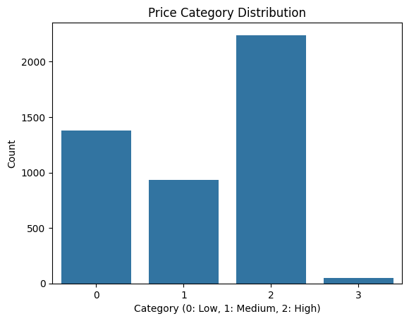
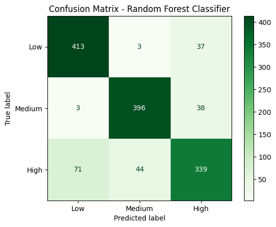
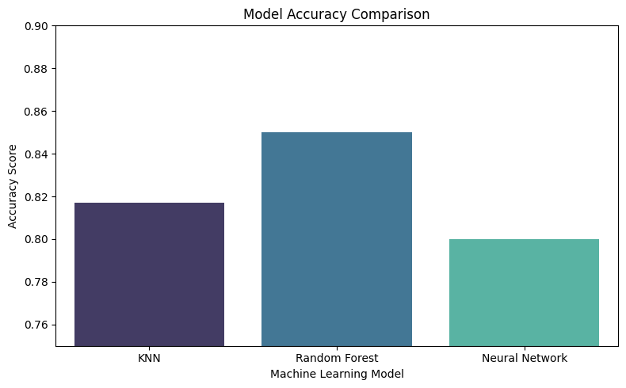

# House Price Classification using Machine Learning

## Project Overview

This project applies machine learning techniques to classify residential properties into price categories based on a range of housing features. The project follows a complete machine learning workflow, including data preprocessing, exploratory data analysis, model training, hyperparameter tuning and performance evaluation.

## Technologies Used

- Python
- Pandas
- NumPy
- Matplotlib
- Seaborn
- Scikit-learn
- Google Colab

## Requirements

The project was developed using Python and requires the following libraries:

- NumPy
- Pandas
- Matplotlib
- Seaborn
- Scikit-learn
- Imbalanced-learn (SMOTE)
- Jupyter Notebook

All required dependencies are listed in the `requirements.txt` file.

## Data Cleaning and Preprocessing

Before training the machine learning models, the dataset was preprocessed to improve data quality and model performance.

The following preprocessing techniques were applied:

- Removed unnecessary columns that were not relevant to the prediction task.
- Checked the dataset for missing values and ensured the data was suitable for analysis.
- Converted categorical variables into numerical values using Label Encoding, allowing them to be processed by machine learning algorithms.
- Applied feature scaling where appropriate to ensure features were on comparable scales, particularly for distance-based algorithms such as K-Nearest Neighbours.
- Balanced the dataset using SMOTE (Synthetic Minority Oversampling Technique) to reduce class imbalance and improve the model's ability to classify minority classes.
- Split the processed dataset into training and testing sets to evaluate model performance on unseen data.


## Exploratory Data Analysis

Exploratory Data Analysis (EDA) was carried out to better understand the structure and characteristics of the dataset before model development.

The analysis included:

- Examining the distribution of house price categories to identify class imbalance.
- Analysing feature distributions to understand the range and spread of numerical variables.
- Generating a correlation heatmap to identify relationships between numerical features and the target variable.
- Investigating patterns and trends within the dataset to determine which features were likely to contribute most to accurate classification.
- Creating visualisations to identify potential outliers and support feature selection during preprocessing.

The insights gained from EDA informed the data preprocessing stage and helped guide the selection of appropriate machine learning models.

## Machine Learning Models

Three machine learning algorithms were implemented and evaluated to classify house price categories:

### K-Nearest Neighbours (KNN)
KNN was selected as a baseline distance-based classification algorithm. Feature scaling was applied before training to ensure all features contributed equally when calculating distances between data points.

### Random Forest
A Random Forest classifier was trained to improve predictive performance by combining multiple decision trees. Hyperparameter tuning was performed using GridSearchCV to identify the optimal model configuration and improve classification accuracy.

### Multi-Layer Perceptron (MLP) Neural Network
A Multi-Layer Perceptron (MLP) classifier was implemented to evaluate the performance of a neural network on the dataset. The model learned complex relationships between features and was compared with the other classification algorithms.

All models were evaluated using classification metrics including accuracy, precision, recall, F1-score and confusion matrices. Their performance was compared to identify the model that provided the most reliable classification results.

## Results

Three machine learning models were trained and evaluated using classification metrics including accuracy, precision, recall, F1-score and confusion matrices.

The Random Forest classifier achieved the strongest overall performance, providing the highest classification accuracy and the most consistent predictions across the house price categories.

A comparison of all models demonstrated that ensemble learning outperformed both the K-Nearest Neighbours and Multi-Layer Perceptron models for this dataset.

## Visualisations

### House Price Distribution




This visualisation illustrates the distribution of house price categories within the dataset. Examining the class distribution helped identify potential class imbalance before model training, informing the use of preprocessing techniques such as SMOTE to improve model performance.

### Correlation Heatmap


The heatmap was used during exploratory data analysis to identify relationships between the features and understand which variables were likely to influence the target variable.

#### Confusion Matrix



The confusion matrix provides a detailed evaluation of the model's classification performance by comparing predicted and actual house price categories. It highlights correctly classified instances as well as areas where the model made misclassifications, offering greater insight than accuracy alone.

#### Model Performance Comparison



This chart compares the performance of the machine learning models evaluated throughout the project, including K-Nearest Neighbours (KNN), Random Forest, and a Neural Network (MLP). Comparing multiple models enabled the selection of the best-performing approach based on classification accuracy and overall predictive performance.


## Future Improvements

Several enhancements could be made to further improve the performance and usability of this project:

- Evaluate additional machine learning algorithms such as XGBoost, LightGBM and Support Vector Machines for comparison.
- Perform more extensive hyperparameter tuning to further optimise model performance.
- Explore additional feature engineering techniques to improve predictive accuracy.
- Deploy the trained model as a web application using Streamlit or Flask, allowing users to interact with the model through a simple interface.
- Test the model on larger and more diverse housing datasets to evaluate its generalisation and robustness.
- Implement cross-validation and additional evaluation metrics to further assess model reliability.

## Installation

1. Clone this repository:

```bash
git clone https://github.com/YOUR_USERNAME/house-price-classification.git
```

2. Navigate to the project directory:

```bash
cd house-price-classification
```

3. Install the required dependencies:

```bash
pip install -r requirements.txt
```

4. Open the Jupyter Notebook (or Google Colab) and run the notebook cells in sequence to reproduce the analysis, train the models and evaluate the results.