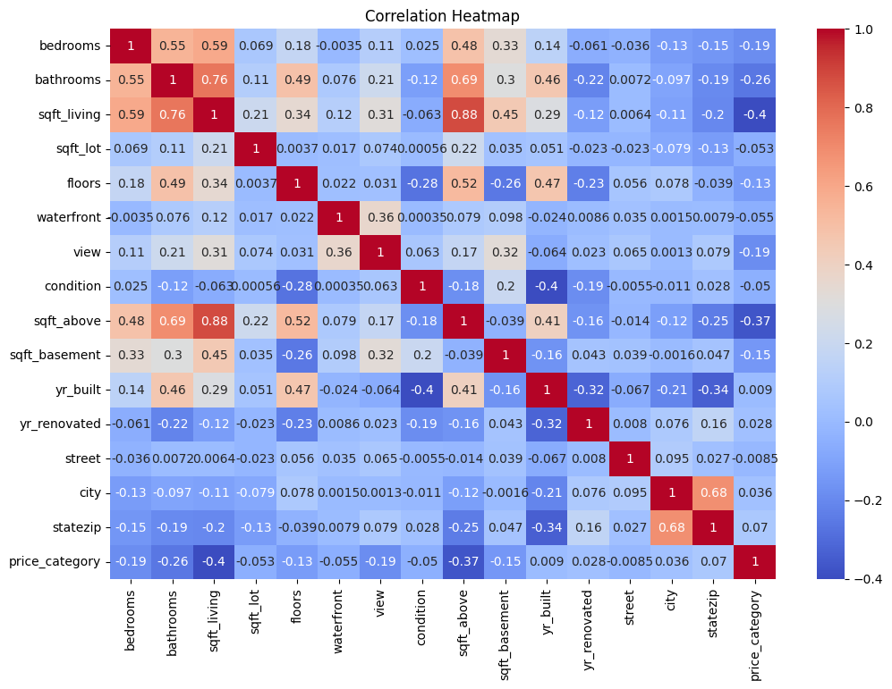

# House Price Classification using Machine Learning

## Overview

This project applies machine learning techniques to classify residential properties into price categories based on a range of housing features. The project follows a complete machine learning workflow, including data preprocessing, exploratory data analysis, model training, hyperparameter tuning and performance evaluation.

## Technologies Used

- Python
- Pandas
- NumPy
- Matplotlib
- Seaborn
- Scikit-learn
- Google Colab

## Data Cleaning and Feature Engineering

## Exploratory Data Analysis

## Machine Learning Models

## Results

## Visualisations

### Correlation Heatmap

The heatmap was used during exploratory data analysis to identify relationships between the features and understand which variables were likely to influence the target variable.

## Future Improvements
